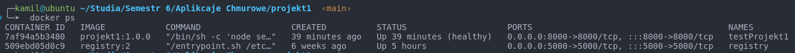
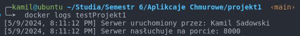

# Project1 - University report

## Building image
First step to run application is to build an image, when you're in main directory type in terminal:
```sh
 docker build --build-arg VERSION=1.0.0 --no-cache -t projekt1:1.0.0 .
```
You can check if image was built correctly by typing:
```sh
docker images --filter reference=projekt1
```
or
```sh
docker images | grep projekt1
```
## Running container
If the image has been built correctly you can run it by typing:
```sh
docker run -d -p 8000:8000 --name projekt1 projekt1:1.0.0
```
Just make sure if port 8000 isn't already allocated on your machine, anyway you can change it \
Now if you type:
```sh
docker ps
```
You should see something like this:


## Checking logs
After succesfully running container you can check logs from server by typing:
```sh
docker logs projekt1
```
Logs should look like this: \


## Testing application
When container is running you can open your web browser and type in search bar http://localhost:8000 \
App sholud look like this: \
 \
Of course with your full IP address

## Additional info
After building image you can check how many layers it has by typing:
```sh
docker history projekt1:1.0.0
```
